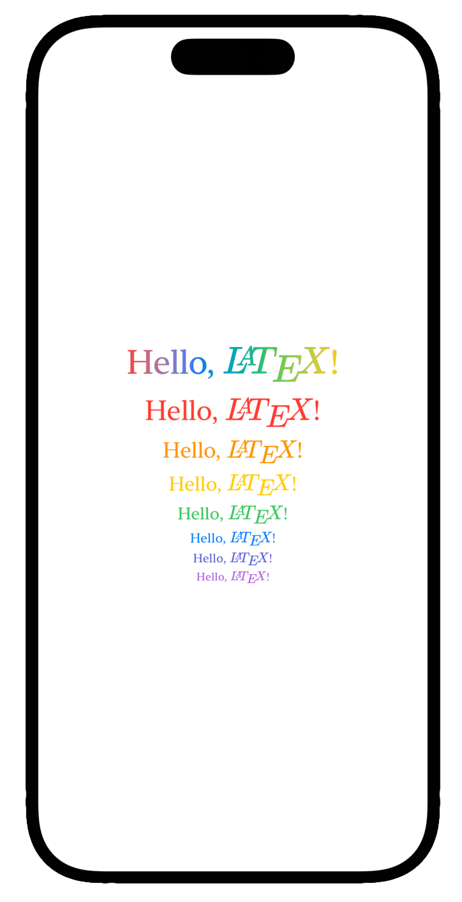
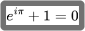
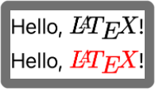
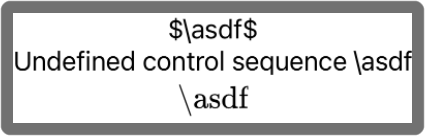
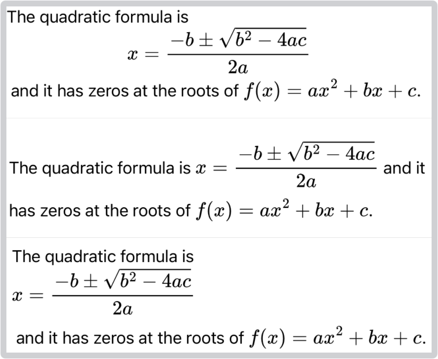
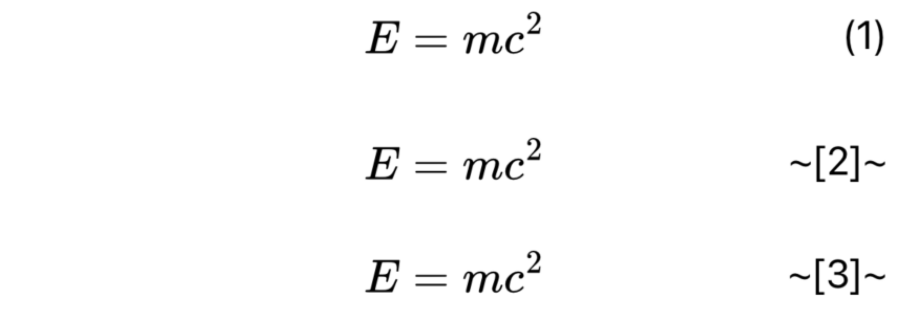
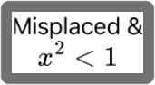

# LaTeXSwiftUI

A SwiftUI view that renders LaTeX equations.

[](https://swiftpackageindex.com/colinc86/LaTeXSwiftUI) [](https://swiftpackageindex.com/colinc86/LaTeXSwiftUI) [](https://github.com/colinc86/LaTeXSwiftUI/actions/workflows/swift.yml)

<center></center>

## 📖 Contents

- [About](#ℹ️-about)
- [Installation](#📦-installation)
- [Usage](#⌨️-usage)
  - [Modifiers](#⚙️-modifiers)
    - [Parsing Mode](#🔤-parsing-mode)
    - [Image Rendering Mode](#🌄-image-rendering-mode)
    - [Error Mode](#🚨-error-mode)
    - [Block Rendering Mode](#🧱-block-rendering-mode)
    - [Numbered Block Equations](#🔢-numbered-block-equations)
      - [Equation Number Mode](#equation-number-mode)
      - [Equation Number Start](#equation-number-start)
      - [Equation Number Offset](#equation-number-offset)
      - [Format Equation Number](#format-equation-number)
    - [Unencode HTML](#🔗-unencode-html)
    - [Rendering Style](#🕶️-rendering-style)
    - [Rendering Animation](#🪩-animated)
  - [Styles](#🪮-styles)
  - [Caching](#🗄️-caching)
  - [Preloading](#🏃‍♀️-preloading)
  
## ℹ️ About

`LaTexSwiftUI` is a package that exposes a view named `LaTeX` that can parse and render TeX and LaTeX equations which contain math-mode marcos.

The view utilizes the [MathJaxSwift](https://www.github.com/colinc86/MathJaxSwift) package to render equations with [MathJax](https://www.mathjax.org). Thus, the limitations of the view are heavily influenced by the [limitations](https://docs.mathjax.org/en/v2.7-latest/tex.html#differences) of MathJax.

It will
- render TeX and LaTeX equations (math-mode macros),
- render the `\text{}` macro within equations,
- attempt to render block equations as a TeX or LaTeX engine would,
- and number block equations (if desired).

It won't
- render TeX and LaTeX documents (text-mode macros, with the exception of the rule above).

## 📦 Installation

Add the dependency to your package manifest file.

```swift
.package(url: "https://github.com/colinc86/LaTeXSwiftUI", from: "1.3.2")
```

## ⌨️ Usage

Import the package and use the view.

```swift
import LaTeXSwiftUI

struct MyView: View {

  var body: some View {
    LaTeX("Hello, $\\LaTeX$!")
  }

}
```

> 

### ⚙️ Modifiers

The `LaTeX` view's body is built up of `Text` views so feel free to use any of the supported modifiers.

```swift
LaTeX("Hello, $\\LaTeX$!")
  .fontDesign(.serif)
  .foregroundColor(.blue)
```

> 

Along with supporting the built-in SwiftUI modifies, `LaTeXSwiftUI` defines more to let you configure the view.

#### 🔤 Parsing Mode

Text input can either be completely rendered, or the view can search for top-level equations delimited by the following terminators.

| Terminators |
|-------------|
| `$...$` |
| `$$...$$` |
| `\[...\]` |
| `\begin{equation}...\end{equation}` |
| `\begin{equation*}...\end{equation*}` |

 The default behavior is to only render equations with `onlyEquations`. Use the `parsingMode` modifier to change the default behavior.

```swift
// Only parse equations (default)
LaTeX("Euler's identity is $e^{i\\pi}+1=0$.")
  .font(.system(size: 18))
  .parsingMode(.onlyEquations)

// Parse the entire input
LaTeX("\\text{Euler's identity is } e^{i\\pi}+1=0\\text{.}")
  .parsingMode(.all)
```

> 

#### 🌄 Image Rendering Mode

You can specify the rendering mode of the rendered equations so that they either take on the style of the surrounding text or display the style rendered by MathJax. The default behavior is to use the `template` rendering mode so that images match surrounding text.

```swift
// Render images to match the surrounding text
LaTeX("Hello, $\\color{red}\\LaTeX$!")
  .imageRenderingMode(.template)

// Display the original rendered image
LaTeX("Hello, ${\\color{red} \\LaTeX}$!")
  .imageRenderingMode(.original)
```

> 

#### 🚨 Error Mode

When an error occurs while parsing the input the view will display the original LaTeX. You can change this behavior by modifying the view's `errorMode`.

> Note: when the `rendered` mode is used, MathJax is instructed to load the `noerrors` and `noundefined` packages. In the other two modes, `original` and `error`, these packages are not loaded by MathJax and errors are either displayed in the view, or caught and replaced with the original text.

```swift
// Display the original text instead of the equation
LaTeX("$\\asdf$")
  .errorMode(.original)

// Display the error text instead of the equation
LaTeX("$\\asdf$")
  .errorMode(.error)

// Display the rendered image (if available)
LaTeX("$\\asdf$")
  .errorMode(.rendered)
```

> 

#### 🧱 Block Rendering Mode

The typical "LaTeX-ish" way to render the input is with `blockViews`. This mode renders text as usual, and block equations as... blocks; on their own line and centered. MathJax 3 does not support line breaking, so the view places block equations in horizontal scroll views in case the width of the equation is more than the width of the view.

In the case that you want to force block equations as inline, you can use the `alwaysInline` mode. You can also keep block styling with `blockText`, but the blocks will not be centered in their views. These modes can be helpful if you have a lengthy input string and need to only display it on a single or few lines.

```swift
/// The default block mode 
LaTeX("The quadratic formula is $$x=\\frac{-b\\pm\\sqrt{b^2-4ac}}{2a}$$ and it has zeros at the roots of $f(x)=ax^2+bx+c$.")
  .blockMode(.blockViews)

Divider()

/// Force blocks to render as inline
LaTeX("The quadratic formula is $$x=\\frac{-b\\pm\\sqrt{b^2-4ac}}{2a}$$ and it has zeros at the roots of $f(x)=ax^2+bx+c$.")
  .blockMode(.alwaysInline)

Divider()

/// Force blocks to render as text with newlines
LaTeX("The quadratic formula is $$x=\\frac{-b\\pm\\sqrt{b^2-4ac}}{2a}$$ and it has zeros at the roots of $f(x)=ax^2+bx+c$.")
  .blockMode(.blockText)
```

> 

#### 🔢 Numbered Block Equations

The `LaTeX` view can do simple numbering of block equations with the `blockViews` block mode.

##### Equation Number Mode

Use the `equationNumberMode` modifier to change between `left`, `right` and `none`.

##### Equation Number Start

The default starting number is `1`, but if you need to start at a different value, you can specify it with the `equationNumberStart` modifier.

##### Equation Number Offset

To change the left or right offset of the equation number, use the `equationNumberOffset` modifier.

##### Format Equation Number

You can set a closure on the view to do your own custom formatting. The `formatEquationNumber` modifier takes a closure that is passed the equation number and returns a string.

```swift
LaTeX("$$E = mc^2$$")
  .equationNumberMode(.right)
  .equationNumberOffset(10)
  .padding([.bottom])

LaTeX("$$E = mc^2$$ $$E = mc^2$$")
  .equationNumberMode(.right)
  .equationNumberOffset(10)
  .equationNumberStart(2)
  .formatEquationNumber { n in
    return "~[\(n)]~"
  }
```

> 

#### 🔗 Unencode HTML

Input may contain HTML entities such as `&lt;` which will not be parsed by LaTeX as anything meaningful. In this case, you may use the `unencoded` modifier.

```swift
LaTeX("$x^2&lt;1$")
  .errorMode(.error)

// Replace "&lt;" with "<"
LaTeX("$x^2&lt;1$")
  .unencoded()
```

> 

#### 🕶️ Rendering Style

The view has four rendering styles. The `wait` style is the default style, and loads the view synchronously on the main queue. To get better performance and move SVG rendering off of the main queue, use any of the other three styles.

| Style      | Asynchronous | Description                                                              |
|:-----------|:-------------|:-------------------------------------------------------------------------|
| `empty`    | Yes          | The view remains empty until its finished rendering.                     |
| `original` | Yes          | The view displays the input text until its finished rendering.           |
| `progress` | Yes          | The view displays a progress view until its finished rendering.          |
| `wait`     | No           | *(default)* The view blocks the main queue until its finished rendering. |


#### 🪩 Rendering Animation

When using the asynchronous rendering styles `empty`, `original`, or `progress`, use this modifier to determine the animation applied to the transition between views. The default value is `none`.

```swift
LaTeX(input)
  .renderingStyle(.original)
  .renderingAnimation(.easeIn)
```

> In the above example, the input text will be displayed until the SVGs have been rendered at which point the rendered views will animate in to view.

### 🪮 Styles

You can use the provided view styles or create your own.

```swift
// The default view style.
LaTeX(input)
  .latexStyle(.automatic)

// A "standard" style with HTML elements unencoded and block equations numbered.
LaTeX(input)
  .latexStyle(.standard)  
```

To create your own style, conform to the `LaTeXStyle` protocol. Its `makeBody(content:)` method takes a `LaTeX` view and returns a stylized version of the view.

The following would create a style for the first title used at the [top](#latexswiftui) of this README.

```swift
@available(iOS 16.1, *)
public struct TitleLaTeXStyle: LaTeXStyle {
  
  public func makeBody(content: LaTeX) -> some View {
    content
      .fontDesign(.serif)
      .font(.largeTitle)
      .foregroundStyle(
          LinearGradient(
            colors: [.red, .orange, .yellow, .green, .blue, .indigo, .purple],
            startPoint: .leading,
            endPoint: .trailing
          )
        )
  }
  
}
```

### 🗄️ Caching

`LaTeXSwiftUI` caches its SVG responses from MathJax and the images rendered as a result of the view's environment. If you want to control the cache, then you can access the static `dataCache` and `imageCache` properties.

```swift
// Clear the SVG data cache.
LaTeX.dataCache.removeAllObjects()

// Clear the rendered image cache.
LaTeX.imageCache.removeAllObjects()
```

### 🏃‍♀️ Preloading

SVGs and images are rendered and cached on demand, but there may be situations where you want to preload the data so that there is minimal lag when the view appears.

```swift
VStack {
  ForEach(expressions, id: \.self) { expression in
    LaTeX(expression)
      .font(.caption2)
      .foregroundColor(.green)
      .unencoded()
      .errorMode(.error)
      .processEscapes()
      .preload()
  }
}
```

SVGs and images are rendered as a result of the view's environment, so it is important to call the `preload` method last in the view's modifier chain if you use it.
