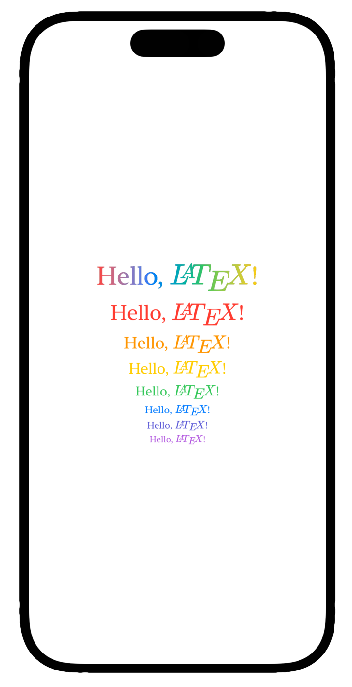
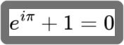
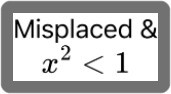
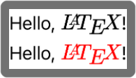
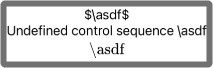
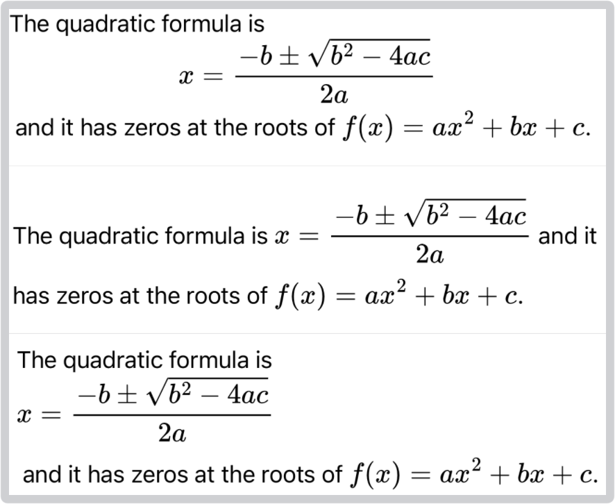
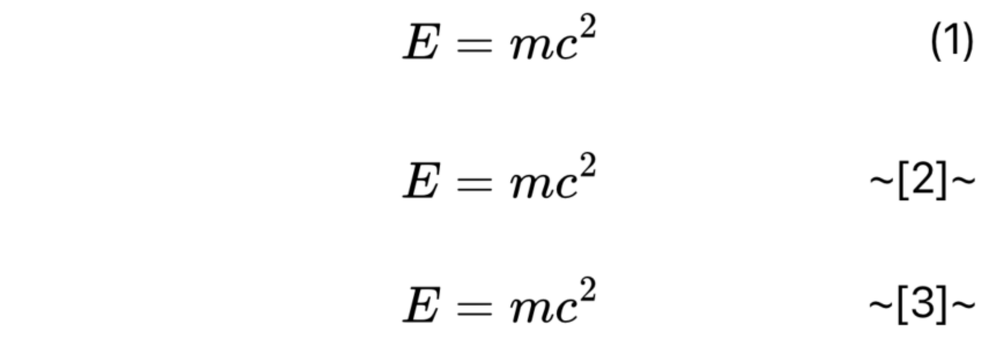

# LaTeXSwiftUI

✨ Beautifully rendered LaTeX equations in SwiftUI — powered by MathJax.

[](https://swiftpackageindex.com/colinc86/LaTeXSwiftUI) [](https://swiftpackageindex.com/colinc86/LaTeXSwiftUI) [](https://github.com/colinc86/LaTeXSwiftUI/actions/workflows/swift.yml)

<center></center>

## 🆕 What's New in v2

- ♿ **[Accessibility](#-accessibility)** — VoiceOver support via the Speech Rule Engine (SRE)
- 🌐 **[Script Scaling](#script-mode)** — CJK and non-Latin script support with `.script()`
- 📐 **[Line Spacing](#line-spacing)** — Automatic normalization on iOS 18+ / macOS 15+
- 📊 **[Arrays & Tables](#arrays--tables)** — `array`, `matrix`, `cases`, and more with borders and rules
- 🔲 **[Redacted Placeholder](#rendering-style)** — New `redactedOriginal` async rendering style
- 🖼️ **[Render to Image](#-rendering-to-images)** — Render LaTeX to `UIImage`/`NSImage` without a SwiftUI view
- 🧩 **[Generic Environments](#generic-environments)** — `\begin{align}`, `\begin{cases}`, etc. work standalone

## 📖 Contents

- [ℹ️ About](#-about)
- [📦 Installation](#-installation)
- [🚀 Quick Start](#-quick-start)
- [⌨️ Usage](#%EF%B8%8F-usage)
  - [🔤 Fonts](#-fonts)
  - [🔧 Parsing & Input](#-parsing--input)
  - [🎨 Visual & Layout](#-visual--layout)
  - [♿ Accessibility](#-accessibility)
  - [🖼️ Rendering to Images](#-rendering-to-images)
  - [⚡ Performance & Caching](#-performance--caching)

## ℹ️ About

`LaTeXSwiftUI` is a package that exposes a `LaTeX` view capable of parsing and rendering TeX and LaTeX equations containing math-mode macros. It uses the [MathJaxSwift](https://www.github.com/colinc86/MathJaxSwift) package to render equations with [MathJax](https://www.mathjax.org), so the view's capabilities are influenced by MathJax's [supported features](https://docs.mathjax.org/en/latest/input/tex/extensions.html).

The view renders math-mode equations (inline and block), `\text{}` within equations, numbered block equations, any `\begin{...}...\end{...}` environment (including `align`, `gather`, `cases`, `array`, and more), and provides VoiceOver accessibility via the Speech Rule Engine. It scales equations for non-Latin scripts and normalizes line spacing on iOS 18+ / macOS 15+. You can also render equations directly to `UIImage`/`NSImage` without a SwiftUI view. It does **not** render full LaTeX documents or text-mode macros.

Requires Swift 6.0. Supports iOS 15+, macOS 12+, and visionOS 1+. All rendering is performed off the main thread.

## 📦 Installation

Add the dependency to your package manifest file.

```swift
.package(url: "https://github.com/colinc86/LaTeXSwiftUI", from: "2.0.0")
```

## 🚀 Quick Start

```swift
import LaTeXSwiftUI

struct MyView: View {

  var body: some View {
    LaTeX("Hello, $\\LaTeX$!")
  }

}
```

> 

That's it! The `LaTeX` view's body is built from `Text` views, so standard SwiftUI modifiers work out of the box.

```swift
LaTeX("Hello, $\\LaTeX$!")
  .fontDesign(.serif)
  .foregroundColor(.blue)
```

> 

## ⌨️ Usage

### 🔤 Fonts

The view measures the current font's x-height to correctly size rendered equations. It converts SwiftUI's `Font` to `UIFont`/`NSFont` internally, which currently works with SwiftUI's preferred fonts (`largeTitle`, `title`, `headline`, `caption`, etc.) and platform font types passed directly.

```swift
// SwiftUI preferred fonts
LaTeX("Hello, $\\LaTeX$!")
  .font(.title)

// UIFont/NSFont passed directly
LaTeX("Hello, $\\LaTeX$!")
  .font(UIFont.systemFont(ofSize: 30))

LaTeX("Hello, $\\LaTeX$!")
  .font(UIFont(name: "Avenir", size: 25)!)
```

> ⚠️ Custom SwiftUI fonts (`.custom(name:size:)`, `.system(size:)`) and `UIFont`/`NSFont` wrapped in `Font()` will not size equations correctly. Use preferred fonts or pass platform font types directly.

### 🔧 Parsing & Input

#### Parsing Mode

The view can search for top-level equations delimited by the following terminators, or render the entire input as math.

| Terminators |
|-------------|
| `$...$` |
| `$$...$$` |
| `\(...\)` |
| `\[...\]` |
| `\begin{equation}...\end{equation}` |
| `\begin{equation*}...\end{equation*}` |
| `\begin{...}...\end{...}` |

##### Generic Environments

Any `\begin{name}...\end{name}` environment is automatically recognized as a block equation — including `align`, `gather`, `cases`, `array`, `matrix`, `pmatrix`, and more. There's no need to wrap them in `$$...$$`.

```swift
LaTeX("The function is \\begin{cases} x & \\text{if } x \\geq 0 \\\\ -x & \\text{if } x < 0 \\end{cases}")
```

```swift
// Only parse equations (default)
LaTeX("Euler's identity is $e^{i\\pi}+1=0$.")
  .parsingMode(.onlyEquations)

// Parse the entire input
LaTeX("\\text{Euler's identity is } e^{i\\pi}+1=0\\text{.}")
  .parsingMode(.all)
```

> 

#### Unencode HTML

Input may contain HTML entities such as `&lt;` which LaTeX won't parse. Use the `unencoded` modifier to decode them.

```swift
LaTeX("$x^2&lt;1$")
  .errorMode(.error)

// Replace "&lt;" with "<"
LaTeX("$x^2&lt;1$")
  .unencoded()
```

> 

#### String Formatting

The view renders the following markdown syntax by default.

| Syntax | Description |
|-------------|-------------|
| `*...*` | Italic |
| `**...**` | Bold |
| `***...***` | Bold & Italic |
| `~~...~~` | Strikethrough |
| `` `...` `` | Monospaced |
| `[...](...)` | Links |

The reserved LaTeX characters `&`, `%`, `$`, `#`, `_`, `{`, `}`, `~`, `^`, and `\` are also unescaped when preceded by a backslash. Use `ignoreStringFormatting()` to disable both markdown rendering and escape replacement.

```swift
LaTeX(input)
  .ignoreStringFormatting()
```

Use `processEscapes()` to allow `\$` for literal dollar signs and `\\` for literal backslashes within your input.

### 🎨 Visual & Layout

#### Image Rendering Mode

Equations can match the surrounding text style or display the original MathJax-rendered colors.

```swift
// Match surrounding text (default)
LaTeX("Hello, $\\color{red}\\LaTeX$!")
  .imageRenderingMode(.template)

// Display original rendered colors
LaTeX("Hello, ${\\color{red} \\LaTeX}$!")
  .imageRenderingMode(.original)
```

> 

#### Error Mode

Control how the view handles rendering errors.

> When `rendered` mode is used, MathJax loads the `noerrors` and `noundefined` packages. In the other modes, errors are either displayed or replaced with the original text.

```swift
LaTeX("$\\asdf$")
  .errorMode(.original)  // Show original text

LaTeX("$\\asdf$")
  .errorMode(.error)     // Show error message

LaTeX("$\\asdf$")
  .errorMode(.rendered)  // Show rendered image if available
```

> 

#### Block Rendering Mode

Block equations can be rendered centered on their own line (`blockViews`, the default), forced inline (`alwaysInline`), or as text with newlines (`blockText`). Block equations are placed in horizontal scroll views when they exceed the view width.

```swift
LaTeX("The quadratic formula is $$x=\\frac{-b\\pm\\sqrt{b^2-4ac}}{2a}$$ and it has zeros at the roots of $f(x)=ax^2+bx+c$.")
  .blockMode(.blockViews)

Divider()

LaTeX("The quadratic formula is $$x=\\frac{-b\\pm\\sqrt{b^2-4ac}}{2a}$$ and it has zeros at the roots of $f(x)=ax^2+bx+c$.")
  .blockMode(.alwaysInline)

Divider()

LaTeX("The quadratic formula is $$x=\\frac{-b\\pm\\sqrt{b^2-4ac}}{2a}$$ and it has zeros at the roots of $f(x)=ax^2+bx+c$.")
  .blockMode(.blockText)
```

> 

#### Numbered Block Equations

The view supports simple numbering of block equations when using `blockViews` mode.

| Modifier | Description |
|:---------|:------------|
| `.equationNumberMode(_:)` | Position: `.left`, `.right`, or `.none` (default) |
| `.equationNumberStart(_:)` | Starting number (default: `1`) |
| `.equationNumberOffset(_:)` | Left or right offset in points |
| `.formatEquationNumber(_:)` | Custom formatting closure `(Int) -> String` |

```swift
LaTeX("$$E = mc^2$$")
  .equationNumberMode(.right)
  .equationNumberOffset(10)
  .padding([.bottom])

LaTeX("$$E = mc^2$$ $$E = mc^2$$")
  .equationNumberMode(.right)
  .equationNumberOffset(10)
  .equationNumberStart(2)
  .formatEquationNumber { n in
    return "~[\(n)]~"
  }
```

> 

#### Rendering Style

All rendering (MathJax conversion and SVG rasterization) is performed off the main thread. Choose a rendering style to control loading behavior.

| Style      | Async | Description                                                              |
|:-----------|:------|:-------------------------------------------------------------------------|
| `empty`    | Yes   | The view remains empty until rendering completes.                         |
| `original` | Yes   | The view displays the input text until rendering completes.               |
| `redactedOriginal` | Yes | The view displays a redacted placeholder until rendering completes. 🆕 |
| `progress` | Yes   | The view displays a progress indicator until rendering completes.         |
| `wait`     | No    | *(default)* The view blocks until rendering completes.                    |

When using an asynchronous style, use `renderingAnimation` to animate the transition.

```swift
LaTeX(input)
  .renderingStyle(.original)
  .renderingAnimation(.easeIn)
```

> **Note:** The `LaTeX` view automatically re-renders when its input string changes, so you can bind it to `@State` variables without needing `.id()`:
> ```swift
> @State var text: String = ""
>
> var body: some View {
>     VStack {
>         TextField("LaTeX", text: $text)
>         LaTeX("$\(text)$")
>     }
> }
> ```

#### Script Mode

🆕 When displaying equations inline with non-Latin scripts such as Korean, Japanese, or Chinese, equations may appear undersized or misaligned. The `script` modifier adjusts equation scaling to match the surrounding text.

```swift
// Korean
LaTeX("방정식 $x^2 + y^2 = z^2$ 은 잘 알려져 있습니다.")
  .script(.cjk)

// Japanese
LaTeX("方程式 $E = mc^2$ は有名です。")
  .script(.cjk)

// Custom scale factor
LaTeX("Scaled equation: $\\int_0^1 x^2 dx$")
  .script(.custom(1.3))
```

| Script | Description |
|:-------|:------------|
| `.latin` | *(default)* Uses the font's x-height. Suitable for Latin, Cyrillic, and similar scripts. |
| `.cjk` | Uses the font's cap-height. Suitable for Korean, Japanese, and Chinese. |
| `.custom(CGFloat)` | Multiplies the font's x-height by the given factor. |

#### Line Spacing

🆕 On iOS 18+ / macOS 15+, the view automatically normalizes line spacing when inline equations cause uneven line gaps. This uses a custom `TextRenderer` and requires no configuration.

#### Arrays & Tables

🆕 The view renders LaTeX array and table environments including `array`, `matrix`, `pmatrix`, `vmatrix`, and `cases`. Horizontal rules (`\hline`) and vertical column borders are supported.

```swift
LaTeX("$$\\begin{pmatrix} a & b \\\\ c & d \\end{pmatrix}$$")

LaTeX("$$\\begin{cases} x & \\text{if } x \\geq 0 \\\\ -x & \\text{if } x < 0 \\end{cases}$$")
```

### ♿ Accessibility

🆕 Rendered equations are images that need accessibility labels for VoiceOver. By default, LaTeXSwiftUI uses MathJax's Speech Rule Engine (SRE) to generate natural language descriptions automatically.

```swift
// Default (.sre) — VoiceOver reads "x squared plus y squared equals z squared"
LaTeX("$x^2 + y^2 = z^2$")

// Use the raw TeX input as the label
LaTeX("$x^2 + y^2 = z^2$")
  .imageAccessibility(.input)

// No accessibility label
LaTeX("$x^2 + y^2 = z^2$")
  .imageAccessibility(.none)

// Custom label
LaTeX("$E = mc^2$")
  .imageAccessibility(.custom("Einstein's mass-energy equivalence"))
```

| Mode | Description |
|:-----|:------------|
| `.sre` | *(default)* Uses the Speech Rule Engine to generate natural language. Falls back to raw TeX on failure. |
| `.input` | Uses the raw TeX input as the accessibility label. |
| `.none` | No accessibility label (default SwiftUI behavior). |
| `.custom(String)` | Uses a custom string as the accessibility label. |

### 🖼️ Rendering to Images

🆕 You can render LaTeX equations directly to `UIImage` (iOS/visionOS) or `NSImage` (macOS) without using the `LaTeX` SwiftUI view. This is useful for UIKit integration, image export, or custom rendering pipelines.

```swift
// Render all equations to images
let images = LaTeX.renderToImages("$x^2 + y^2 = z^2$")

// With custom options
let images = LaTeX.renderToImages(
  "Euler's identity: $e^{i\\pi}+1=0$ and $\\int_0^1 x\\,dx$",
  displayScale: 3.0,
  processEscapes: true
)

// Each equation produces one image
for image in images {
  imageView.image = image
}
```

### ⚡ Performance & Caching

All rendering is performed off the main thread. The package caches both SVG data from MathJax and the rasterized images. You can control the caches directly.

```swift
// Clear the SVG data cache
LaTeX.dataCache.removeAllObjects()

// Clear the rendered image cache
LaTeX.imageCache.removeAllObjects()
```

#### Preloading

SVGs and images are rendered on demand, but you can preload them to minimize lag when the view appears. Call `preload` **last** in the modifier chain.

```swift
VStack {
  ForEach(expressions, id: \.self) { expression in
    LaTeX(expression)
      .font(.caption2)
      .foregroundColor(.green)
      .unencoded()
      .errorMode(.error)
      .processEscapes()
      .preload()
  }
}
```
